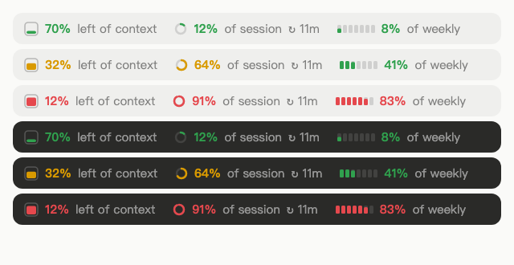

# claude-mods

Claude Code mods, shipped as plugins. Requires Claude Code **2.1.287** or later.

## token-bar

One line above the prompt that shows how full your context window and your plan's usage limits are.



```
▣ 36% of context     ◔ 12% of session ↻ 2h 46m     ▮▯▯▯▯▯▯ 8% of weekly
```

- **Context**: how much of the current conversation's context window is used.
- **Session**: how much of the 5-hour usage limit is used, and when it resets.
- **Weekly**: how much of the weekly usage limit is used.
- Each one is colored like a phone battery: **green** under 60%, **yellow** under 80%, **red** from 80%.
- It updates after every turn, and the quota and countdown refresh every 30 seconds.
- The desktop app draws icons (a filling container, a ring, seven day cells); the terminal draws text.
- When the band is too narrow, groups are hidden from the right and leave a colored `•` behind.

Session and weekly only appear on a Claude subscription, once the first reply of the session has arrived. With an API key there are no usage limits to show, so only the context is drawn.

### Install

In Claude Code:

```
/plugin marketplace add santosli/claude-mods
/plugin install token-bar@santos-mods
```

Or from a shell:

```bash
claude plugin marketplace add santosli/claude-mods
claude plugin install token-bar@santos-mods --scope user
```

Then start a new session (or restart the desktop app).

### Develop

```bash
claude --plugin-dir ./token-bar      # loads it and reloads on every save
claude plugin validate ./token-bar
claude plugin test ./token-bar
```

---

## 中文说明

token-bar 在 Claude Code 输入框上方显示一行用量：

- **context**：当前对话的上下文窗口已用多少
- **session**：5 小时额度已用多少，以及多久后重置
- **weekly**：每周额度已用多少

颜色跟手机电量一样：60% 以下绿色，60–79% 黄色，80% 及以上红色。每轮回复后更新，额度和倒计时每 30 秒刷新一次。session 和 weekly 只在订阅账号下显示（会话收到第一条回复后出现）。

安装：在 Claude Code 里运行

```
/plugin marketplace add santosli/claude-mods
/plugin install token-bar@santos-mods
```

然后新开一个会话（桌面端重启一下 app）。

## License

MIT
