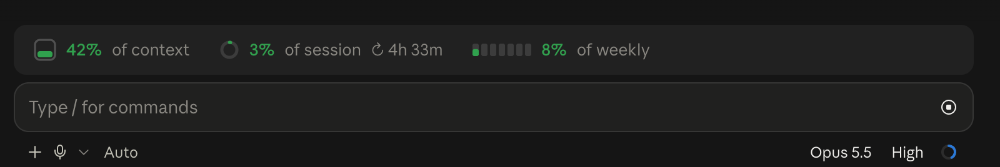

# claude-mods

Claude Code mods, shipped as plugins. Requires Claude Code **2.1.287** or later.

## token-bar

One line above the prompt that shows how full your context window and your plan's usage limits are, and what today's usage would cost at API prices.

https://github.com/user-attachments/assets/d3748a88-43b6-4c02-a343-623e2c3aecdd



```
◔ 36% of context │ ◔ 12% of session ↻ 2h 46m │ ◌ 8% of weekly │ $42.17 today · 118M tokens
```

- **Context**: how much of the current conversation's context window is used.
- **Session**: how much of the 5-hour usage limit is used, and when it resets.
- **Weekly**: how much of the weekly usage limit is used.
- **Today**: tokens used today across all your Claude Code sessions, and what they would cost at API prices (see below).
- Each one is colored like a phone battery: **green** under 60%, **yellow** under 80%, **red** from 80%.
- It updates after every turn and after `/compact` or `/clear`; the quota, countdown and today's total refresh every 30 seconds.
- The desktop app draws rings (context and session fill clockwise; weekly is split into seven arcs, one a day) with a rule between groups; the terminal draws text.
- When the band is too narrow, groups are hidden from the right and leave a colored `•` behind.

Session and weekly only appear on a Claude subscription, once the first reply of the session has arrived. With an API key there are no usage limits to show, so only the context is drawn.

### How today's cost is counted

Today's figure is read from Claude Code's local transcripts (`~/.claude/projects`, `~/.config/claude/projects`, every entry of `CLAUDE_CONFIG_DIR`, and the desktop app's Cowork sessions), so it includes sessions that ran before the plugin loaded. It follows [ccusage](https://github.com/ryoppippi/ccusage)'s rules and matches its `claude daily` output to the cent:

- one count per reply (message id + request id), keeping the fullest copy; a subagent's replay of its parent is not counted twice;
- tokens are input + output + cache reads + cache writes, bucketed by your local day;
- cost uses Anthropic's list prices: 5-minute cache writes at 1.25× input, 1-hour at 2×, fast mode at the model's multiplier.

It is an **API-equivalent** figure: on a subscription you are not billed this amount. Models it has no price for count toward tokens but not cost. The scan reads only new bytes each time and keeps its offsets in `~/.token-bar/`. It runs through `osascript`, so **today's figure is macOS only**; elsewhere the rest of the band works as before.

### Install

In Claude Code:

```
/plugin marketplace add santosli/claude-mods
/plugin install token-bar@santos-mods
```

Or from a shell:

```bash
claude plugin marketplace add santosli/claude-mods
claude plugin install token-bar@santos-mods --scope user
```

Then start a new session (or restart the desktop app).

### Develop

```bash
claude --plugin-dir ./token-bar      # loads it and reloads on every save
claude plugin validate ./token-bar
claude plugin test ./token-bar
```

---

## 中文说明

token-bar 在 Claude Code 输入框上方显示一行用量（[30 秒宣传片](https://github.com/user-attachments/assets/d3748a88-43b6-4c02-a343-623e2c3aecdd)）：

- **context**：当前对话的上下文窗口已用多少
- **session**：5 小时额度已用多少，以及多久后重置
- **weekly**：每周额度已用多少

- **today**：今天所有 Claude Code 会话一共用了多少 token，按 API 价格折算值多少钱

颜色跟手机电量一样：60% 以下绿色，60–79% 黄色，80% 及以上红色。每轮回复后、`/compact` 和 `/clear` 后更新；额度、倒计时和今日用量每 30 秒刷新一次。session 和 weekly 只在订阅账号下显示（会话收到第一条回复后出现）。

今日用量读取本地对话记录，所以插件加载之前的会话也算在内。计算规则和 ccusage 一致（按回复去重、按本地日期统计、按官方价格计费），结果与 `ccusage claude daily` 逐日一致。金额是**按 API 价格的折算值**，订阅用户并不会被这样扣费。今日用量依赖 `osascript`，**仅支持 macOS**。

安装：在 Claude Code 里运行

```
/plugin marketplace add santosli/claude-mods
/plugin install token-bar@santos-mods
```

然后新开一个会话（桌面端重启一下 app）。

## License

MIT
